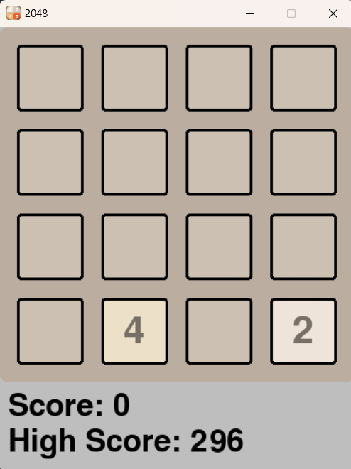
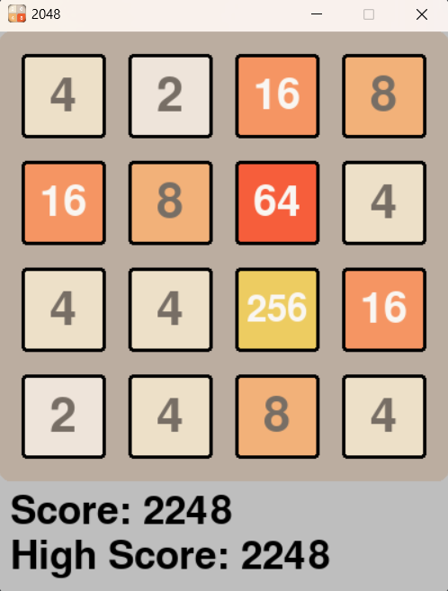
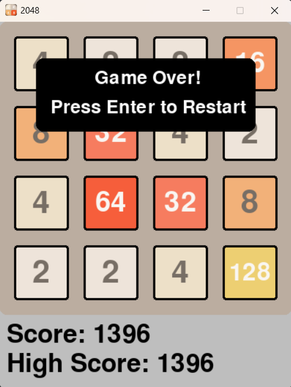

# 2048 Game using Pygame

## 📝 Description
This is an interactive and visually appealing **2048 game** built using the **Pygame module**. The goal of the game is to slide numbered tiles on a **4×4 grid** to combine them and create the **2048 tile**; However, players can continue playing after reaching 2048, creating tiles with even larger numbers. :)

## 🎮 Features
- **Smooth gameplay** with arrow key controls.
- **Automatic high score saving**.
- **Visually appealing UI** with different colors for different tile values.
- **Random tile spawning** after each move.
- **Game Over detection** when no valid moves are available.

## 🛠️ Installation
### Prerequisites
Ensure you have **Python** installed. If not, download and install it from [Python's official website](https://www.python.org/downloads/).

### Install Pygame
Run the following command to install **Pygame**:
```sh
pip install pygame
```

## 🚀 How to Run
1. Download or clone this repository.
2. Navigate to the project folder in the terminal or command prompt.
3. Run the following command:
   ```sh
   python main.py
   ```
4. Use the **arrow keys** to move the tiles.
5. Try to reach the **2048 tile** before running out of moves!

## 🎮 Controls
| Key | Action |
|------|--------|
| ⬆️ (Up Arrow) | Move tiles up |
| ⬇️ (Down Arrow) | Move tiles down |
| ⬅️ (Left Arrow) | Move tiles left |
| ➡️ (Right Arrow) | Move tiles right |
| ↩️ (Enter) | Restart after Game Over |
| ❌ (Close Button) | Exit the game |

## 🖼️ Screenshots
<p align="center">
  
  
</p>
<p align="center">
  
</p>


## 🏆 High Score
- The game automatically saves the highest score in a file named **high_score**.
- The high score persists even after restarting the game.

## 📌 To-Do / Future Improvements
- Improve high score saving mechanism to prevent data loss.
- Game Over Detection Issue
- Optimize tile spawning logic for fairer gameplay.
- Improve Tile Rendering
- Add an **undo move** option.
- Implement **AI-based hints** for optimal moves.
- Create a **leaderboard** system.
- Improve animations and effects.

## 👨‍💻 Author
Developed by **Lovish Mehra**.

## ⚖️ License
This project is **open-source** and free to use.

---

<h2 align="center">Enjoy playing <b>2048</b>! 🎉</h2>


---
## More About this Game 
2048 is a single-player sliding tile puzzle video game written by Italian web developer Gabriele Cirulli and published on GitHub.
The objective of the game is to slide numbered tiles on a grid to combine them to create a tile with the number 2048; However, players can continue playing after reaching 2048, creating tiles with even larger numbers.
